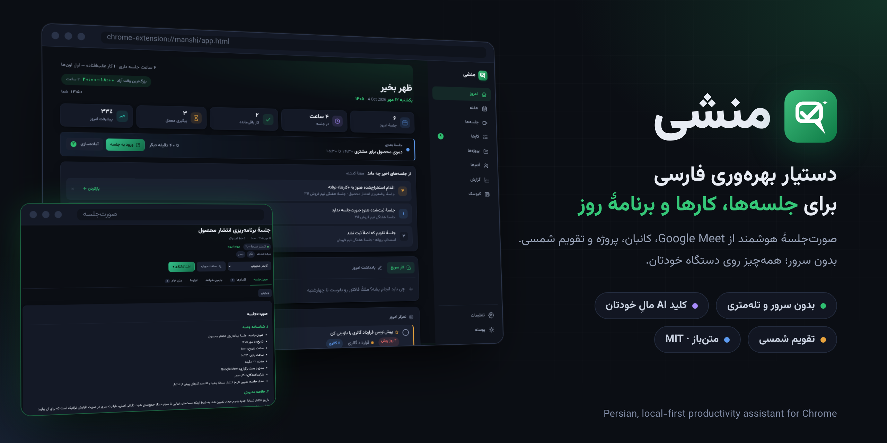
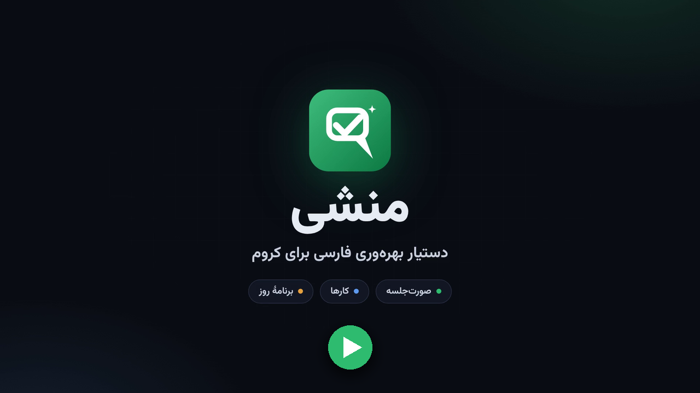
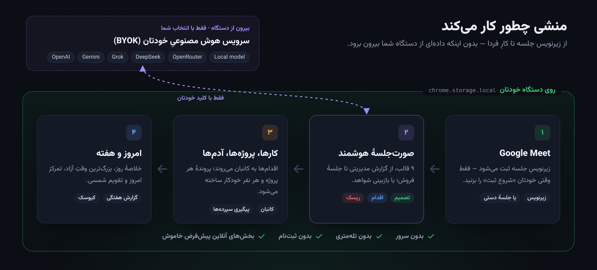
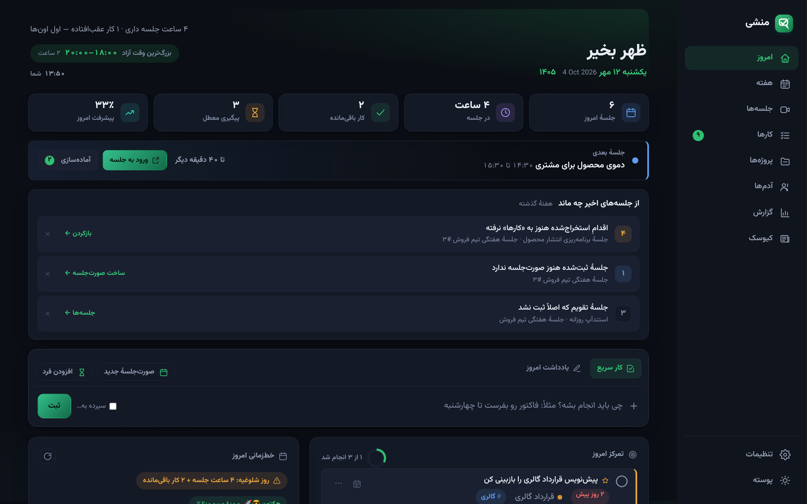
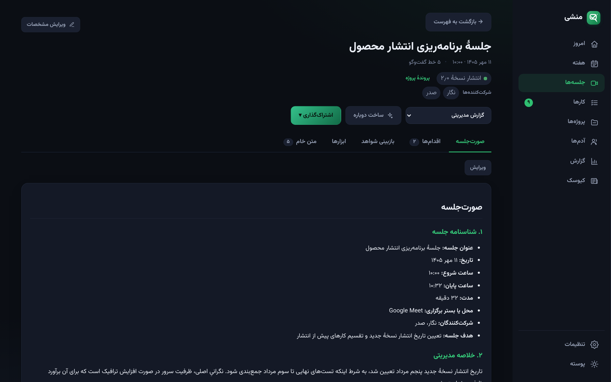
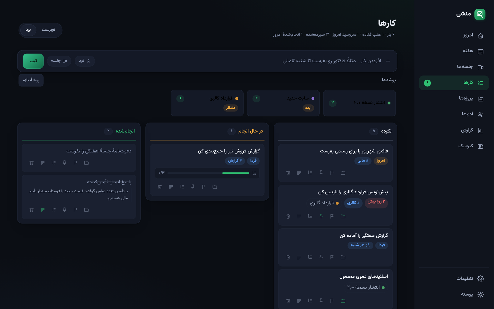
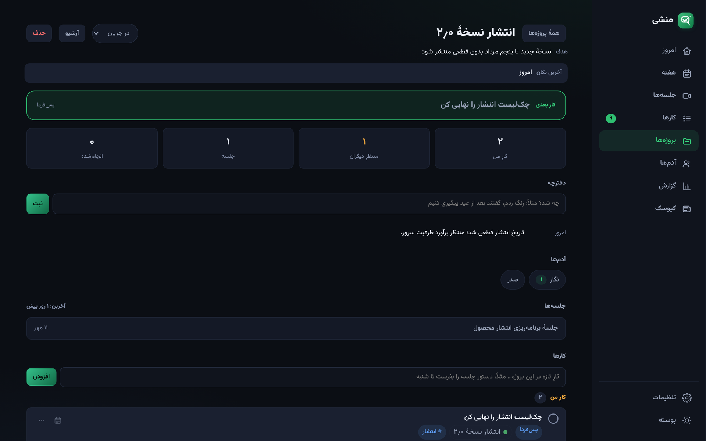
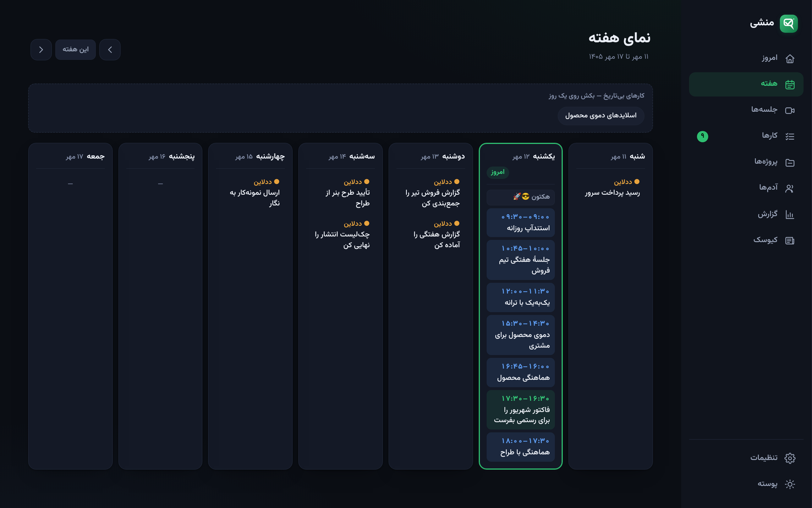
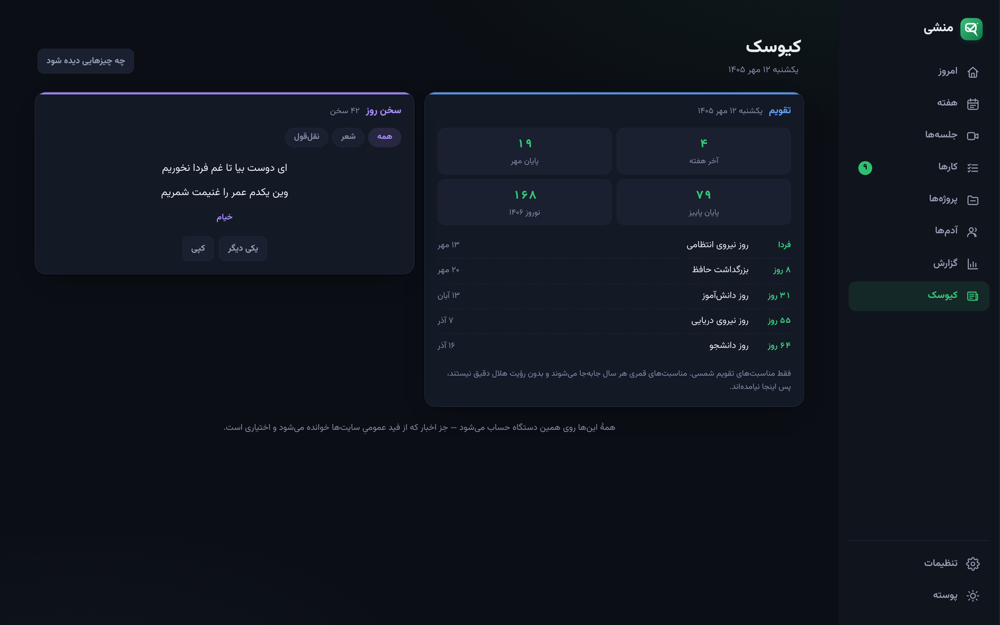

<p align="center">
  
</p>

# منشی — دستیار بهره‌وری

اکستنشن فارسی و راست‌به‌چپ کروم برای جلسه‌ها، کارها و برنامهٔ روز.
**هیچ سروری ندارد.** همهٔ داده‌ها در حافظهٔ محلی مرورگر شماست و کلید هوش مصنوعی هم مالِ خودتان است.

> A Persian, RTL Chrome extension (MV3) for meeting minutes, task management and daily planning.
> Local-first: no backend, no telemetry, bring-your-own AI key.

[](https://github.com/rezatxt27/manshi-suite/actions/workflows/release.yml)

<p align="center">
  <a href="docs/media/manshi-promo.mp4"></a>
  <br><sub>▶ ویدیوی معرفی منشی (۴۰ ثانیه، با صدا) · موسیقیِ ویدیوها برای همین پروژه ساخته شده است</sub>
</p>

---

## چه می‌کند

| بخش | کار |
|---|---|
| **امروز** | خلاصهٔ روز، بزرگ‌ترین وقت آزاد، تمرکز امروز، سرِنخ‌های باز از جلسه‌های اخیر |
| **هفته** | نمای هفتگی تقویم شمسی |
| **جلسه‌ها** | ضبط زیرنویس Google Meet، صورت‌جلسهٔ هوشمند با ۹ قالب، ویرایش دستی، بازبینی شواهد، نسبت‌دادن به پوشه، پرسش‌وپاسخ روی همهٔ جلسه‌ها |
| **پروژه‌ها** | بخش مستقل: فهرست بر اساس مرحله، هدف، دفترچه، افزودن کار، آرشیو، نشانِ راکدی |
| **کارها** | فهرست و کانبان، اولویت، تکرارشونده، زیرکار، توضیحاتِ زمان‌دار، تخمین زمان، پیگیریِ سپرده‌شده‌ها، مرور کارهای پوسیده |
| **آدم‌ها** | پروندهٔ افراد از روی جلسه‌ها و کارها |
| **گزارش** | آمار هفتگی و گزارش متنی |
| **کیوسک** | تقویم و مناسبت‌ها، اوقات شرعی، سخن روز، بازار، بورس، صندوق‌ها، اخبار، تایمر تمرکز |
| **بپرس از AI** | کارهای آماده با سؤالِ ازپیش‌نوشته برای چسباندن در هر چت‌باتی، و پلِ دوطرفهٔ MCP |

<p align="center">
  
</p>

---

## نمایی از منشی

> همهٔ تصاویر با **دادهٔ نمونه و ساختگی** گرفته شده‌اند. تصویرها با پوستهٔ تیره یا روشنِ گیت‌هابِ شما هماهنگ می‌شوند.

**امروز** — خلاصهٔ روز، جلسهٔ بعدی، سرِنخ‌های باز از جلسه‌های اخیر و تمرکز امروز

<picture>
  <source media="(prefers-color-scheme: light)" srcset="docs/images/screens/today-light.png">
  
</picture>

<table>
  <tr>
    <td width="50%" valign="top">
      <b>صورت‌جلسهٔ هوشمند</b><br>
      <sub>از زیرنویس Google Meet، با قالب، اقدام‌ها و بازبینی شواهد</sub><br><br>
      <picture>
        <source media="(prefers-color-scheme: light)" srcset="docs/images/screens/meeting-light.png">
        
      </picture>
    </td>
    <td width="50%" valign="top">
      <b>کارها — کانبان</b><br>
      <sub>اولویت، زیرکار، تکرارشونده و اتصال به پروژه</sub><br><br>
      <picture>
        <source media="(prefers-color-scheme: light)" srcset="docs/images/screens/tasks-board-light.png">
        
      </picture>
    </td>
  </tr>
  <tr>
    <td width="50%" valign="top">
      <b>پروندهٔ پروژه</b><br>
      <sub>هدف، دفترچه، کارِ بعدی، جلسه‌ها و آدم‌های پروژه در یک جا</sub><br><br>
      <picture>
        <source media="(prefers-color-scheme: light)" srcset="docs/images/screens/project-light.png">
        
      </picture>
    </td>
    <td width="50%" valign="top">
      <b>نمای هفته</b><br>
      <sub>تقویم شمسی با جلسه‌ها و سررسیدها؛ کار را روی روز بکش</sub><br><br>
      <picture>
        <source media="(prefers-color-scheme: light)" srcset="docs/images/screens/week-light.png">
        
      </picture>
    </td>
  </tr>
</table>

<details>
<summary><b>کیوسک</b> — تقویم و مناسبت‌ها، سخن روز، بازار و تایمر تمرکز</summary>
<br>
<picture>
  <source media="(prefers-color-scheme: light)" srcset="docs/images/screens/kiosk-light.png">
  
</picture>
</details>

---

## حریم خصوصی

این مهم‌ترین قرارِ این پروژه است:

- **بدون سرور و بدون تله‌متری.** هیچ داده‌ای جایی جز `chrome.storage.local` نمی‌رود.
- **کلید هوش مصنوعی مالِ خودتان است** و فقط به همان سرویسی می‌رود که خودتان انتخاب کرده‌اید. در پشتیبان‌گیری هم پیش‌فرض حذف می‌شود.
- **آدرس iCal مثل رمز عبور** با آن رفتار می‌شود؛ در هیچ لاگ یا خروجی‌ای نمی‌آید.
- فقط آدرس‌های `https` پذیرفته می‌شوند (به‌جز `localhost` برای مدل محلی).
- بخش‌هایی که به اینترنت وصل می‌شوند — **اخبار، بازار، آب‌وهوا و سخن‌های تازه** — همه اختیاری‌اند و **پیش‌فرض خاموش**. تا وقتی روشنشان نکنید هیچ درخواستی نمی‌رود.
- **یک استثنا، با صراحت:** بررسی نسخهٔ تازه پیش‌فرض روشن است — روزی یک بار شمارهٔ آخرین نسخه از گیت‌هاب خوانده می‌شود (یک `GET` ساده، بدون ارسال هیچ داده‌ای). چون منشی از فروشگاه نصب نمی‌شود و خودش به‌روز نمی‌شود، بی‌خبر ماندن از وصله‌ها بدتر از این درخواست است. از تنظیمات می‌توانید خاموشش کنید.
- کیوسک به‌جز اخبار و بازار، کاملاً آفلاین محاسبه می‌شود (اوقات شرعی، مناسبت‌ها، سخن روز).
- **پل هوش مصنوعی هیچ درخواستی نمی‌فرستد.** «بپرس از AI» فقط در کلیپ‌بورد می‌نشیند و
  `snapshot.json` فقط روی دیسکِ خودتان نوشته می‌شود؛ هیچ پورتی باز نمی‌شود.
  خروجی **هیچ تنظیماتی** ندارد — نه کلید API، نه آدرس iCal. متنِ خامِ جلسه‌ها هم فقط
  اگر خودتان سطح را روی «متن کامل» ببرید می‌آید. پوشهٔ snapshot را در دراپ‌باکس یا درایو نگذارید.

### دربارهٔ مجوزها

| مجوز | چرا |
|---|---|
| `storage` | نگه‌داشتن داده‌ها روی همین دستگاه |
| `alarms` | یادآوری صبح و جمع‌بندی آخر روز |
| `notifications` | همان دو اعلان |
| `meet.google.com` (content script) | خواندن زیرنویس، فقط وقتی خودتان «شروع ثبت» را بزنید |
| `https://*/*` (اختیاری) | برای فیدِ اخبار، صفحهٔ قیمت بازار، سخن‌های تازه و بررسی نسخه. تا خودتان اجازه ندهید درخواست نمی‌رود، و می‌توانید هر وقت پس بگیرید. |

`https://*/*` عمداً `optional_host_permissions` است، نه مجوزِ نصب — یعنی موقع نصب چیزی از شما نمی‌خواهد.

---

## نصب

<p align="center">
  <a href="docs/media/install.mp4"></a>
  <br><sub>نسخهٔ ویدیویی با صدا: <a href="docs/media/install.mp4">docs/media/install.mp4</a></sub>
</p>

منشی از فروشگاه کروم نصب نمی‌شود؛ مستقیم از همین مخزن نصب می‌شود:

1. از [آخرین ریلیز](https://github.com/rezatxt27/manshi-suite/releases/latest) و از بخشِ **Assets** فایلِ `manshi-<نسخه>.zip` را دانلود کنید. (فایلِ «Source code» را نگیرید؛ آن تصاویرِ مستندات را هم دارد و ده‌ها برابر بزرگ‌تر است.)
2. فایل را از حالت فشرده خارج کنید. پوشه‌ای به اسم `manshi` درمی‌آید؛ آن را **جایی ثابت** (مثلاً Documents) بگذارید. کروم منشی را از همین پوشه اجرا می‌کند، پس پاکش نکنید.
3. در کروم `chrome://extensions` را باز کنید و **Developer mode** را روشن کنید.
4. **Load unpacked** را بزنید و همان پوشهٔ `manshi` را انتخاب کنید.
5. از آیکون پازل در نوار ابزار، منشی را پین کنید و روی آیکونش بزنید.

### به‌روزرسانی

نسخهٔ تازه که بیاید، خودِ منشی بالای صفحه خبر می‌دهد و همان‌جا زیرِ «چطور به‌روز کنم؟» قدم‌ها را هم می‌گوید. همین‌ها در بخشِ **تنظیمات و به‌روزرسانی** هم هست، و اگر کاری مانده باشد نقطه‌ای کنارِ همان آیتم در ریل روشن می‌شود. سه قدم است:

1. فایلِ `manshi-<نسخه>.zip` را از صفحهٔ ریلیز بگیرید و باز کنید.
2. فایل‌های داخلش را **در همان پوشهٔ قبلی** بریزید و بگذارید جایگزین شوند.
3. در `chrome://extensions` روی کارتِ منشی دکمهٔ **⟳** را بزنید.

جلسه‌ها، کارها و تنظیماتتان دست نمی‌خورد.

> ⚠️ **پوشهٔ تازه نسازید و اسمِ پوشه را عوض نکنید.** کروم شناسهٔ اکستنشنِ بازشده را از مسیرِ پوشه می‌سازد؛ مسیر که عوض شود، منشیِ «تازه‌ای» با حافظهٔ خالی بالا می‌آید و داده‌هایتان در نسخهٔ قبلی جا می‌مانند. برای اطمینان، پیش از به‌روزرسانی از تنظیمات پشتیبان بگیرید.

**برای توسعه‌دهنده‌ها:** به‌جای ZIP می‌توانید کلون کنید و بعداً با `git pull` به‌روز کنید (مسیر ثابت می‌ماند):

```bash
git clone https://github.com/rezatxt27/manshi-suite.git
```

بدون مرحلهٔ build؛ جاوااسکریپت خالص و Manifest V3.

### به‌روزرسانی با یک کلیک (برای نصبِ گیتی)

اگر با `git clone` نصب کرده‌اید، جایگزینیِ پوشه و رفتن به `chrome://extensions`
لازم نیست:

```bash
sh tools/manshi-pull.sh
```

این اسکریپت فایل‌های روی دیسک را جلو می‌برد — فقط fast-forward، و اگر تغییرِ
ذخیره‌نشده‌ای باشد یا روی شاخهٔ main نباشید دست نمی‌زند. لاگش در
`~/Library/Logs/manshi-pull.log` است.

**نکتهٔ مهم:** کروم `manifest.json` را زیر نظر دارد و تا عوض شود افزونه را از نو
بار می‌کند. یعنی همین `git pull` به‌روزرسانی را **همان‌جا اعمال می‌کند** — و
بارِ دوباره، ثبتِ یک جلسهٔ در جریان را قطع می‌کند. پس این دستور را وقتی بزنید که
جلسه‌ای در حال ثبت نیست.

برای اینکه تصمیم دستِ خودتان بماند، حالتِ دوم هست:

```bash
sh tools/manshi-pull.sh --if-requested
```

این حالت هیچ‌کاری نمی‌کند مگر در منشی دکمهٔ **«گرفتن و اعمال»** را زده باشید
(کنارِ خبرِ نسخهٔ تازه؛ نیاز به روشن بودنِ «فایل snapshot» دارد). منشی فقط یک
فایلِ کوچک در پوشهٔ snapshot می‌گذارد و این اسکریپت *بودنِ* آن را می‌بیند —
محتوایش خوانده نمی‌شود. همین دستور را هر نیم‌دقیقه زمان‌بندی کنید —
`launchd` روی مک، Task Scheduler روی ویندوز، `cron` یا `systemd` روی لینوکس؛ آن وقت نسخهٔ تازه فقط وقتی می‌آید که خودتان خواسته باشید.
زمان‌بندی عمداً در مخزن نیست: تصمیمش با خودتان است.

وقتی فایل‌های تازه بیایند ولی کروم هنوز اعمالشان نکرده باشد، منشی نواری نشان
می‌دهد با دکمهٔ **«اعمال کن»** که افزونه را از نو بار می‌کند. تب‌های بازِ منشی
بعدش برمی‌گردند و داده‌ها دست نمی‌خورند.

---

## ساختار

```
app.html · app.css · app.js    پوستهٔ اپ: ریل کناری، مسیریابی، دیزاین‌سیستم
background.js                  Service Worker: زنگ‌ها، نوار آدرس، به‌روزرسانی تقویم
content.js · content.css       ضبط زیرنویس در Google Meet
core/
  jalali.js                    تاریخ شمسی
  date-parser.js               تجزیهٔ تاریخ و تکرارِ طبیعیِ فارسی
  store.js                     لایهٔ داده: کارها، آدم‌ها، جلسه‌ها، پشتیبان
  ics.js                       تقویم iCal: RRULE، لغو، جابه‌جایی
  ai-client.js                 کلاینت BYOK چنداتصالی
  mom-core.js                  صورت‌جلسه: قالب‌ها، تکه‌بندی، پرامپت‌ها
  transcript-cleaner.js        پاک‌سازی و شکستنِ نوبت‌های زیرنویس
  search.js                    جست‌وجو و پرسش‌وپاسخ روی جلسه‌ها
  kiosk.js                     تقویم، اوقات شرعی، سخن روز (همه آفلاین)
  market.js                    تجزیهٔ قیمت ارز و طلا
  bourse.js                    بورس: شاخص کل، بیشترین رشد، افت و پرمعامله
  funds.js                     صندوق‌ها: بازدهیِ بازه‌ای از تاریخچهٔ قیمت
  update.js                    بررسی نسخهٔ تازه از گیت‌هاب
  agenda.js                    وقت آزاد، سریِ جلسه‌ها، تطبیق با تقویم، نرمال‌سازی جست‌وجو
  snapshot.js                  کارهای آماده، بستهٔ کلیپ‌بورد، و عکسِ لحظه‌ای (JSON)
  inbox.js                     صندوق ورودی: صورت‌جلسهٔ رسیده از بیرون (ورودی نامعتمد)
  mcp-tools.js                 تعریف ابزارهای MCP — منبعِ واحدِ سرور و راهنما
mcp/manshi-mcp.js              سرور MCP، بدون وابستگی — راهنما در mcp/README.md
tools/manshi-pull.sh           آوردنِ نسخهٔ تازه روی دیسک — با --if-requested فقط به درخواستِ خودت
tests/run.js                   ۶۰۲ تست، بدون هیچ وابستگی
```

## تست

```bash
node tests/run.js
```

بدون وابستگی و بدون نصب. تست‌ها شامل بررسی‌های امنیتی هم هستند (رد شدن `http` بیرونی، پاک‌سازی `javascript:` از تقویم، و…).

---

## سرویس‌های هوش مصنوعی

OpenAI · Gemini · Grok · DeepSeek · OpenRouter · GapGPT · هر سرویسِ سازگار با OpenAI · مدل محلی روی `localhost`

می‌توانید چند اتصال تعریف کنید و برای هر جلسه یکی را انتخاب کنید.

---

## مشارکت

اگر باگی دیدید یا آدرسِ فیدی از کار افتاد، Issue باز کنید. برای تغییر کد، لطفاً `node tests/run.js` را قبل از PR اجرا کنید.

## بازرسی امنیتی پیش از انتشار

این پروژه یک بازرسِ خودکار دارد که جلوی رفتنِ دادهٔ حساس به مخزن را می‌گیرد:
کلید و توکن، آدرس مخفی iCal، ایمیل روی دامنهٔ واقعی، شمارهٔ تلفن، نامِ کاربریِ دستگاه، `eval` در کدِ محصول،
فایل‌های `.env`/`.pem`/پشتیبان، و اجرای تست‌ها. هم آنچه در حالِ کامیت است بررسی می‌شود
هم کلِ تاریخچهٔ گیت.

```bash
sh .github/scripts/security-check.sh
```

**برای اینکه خودکار قبل از هر `git push` اجرا شود، یک بار این را بزنید:**

```bash
git config core.hooksPath .githooks
```

(این تنظیم محلی است و با کلون منتقل نمی‌شود، پس روی هر دستگاه یک بار لازم است.)
اگر بازرسی چیزی پیدا کند، پوش انجام نمی‌شود.

## انتشار نسخهٔ تازه

ریلیز خودکار است. تنها کارِ لازم:

1. شمارهٔ نسخه را در `manifest.json` بالا ببر
2. بخشِ همان نسخه را به بالای `CHANGELOG.md` اضافه کن
3. پوش کن

بعدش خودِ گیت‌هاب: تست‌ها را می‌گیرد، و اگر پاس شدند تگ `v<نسخه>` و ریلیز را با متنِ همان بخشِ CHANGELOG می‌سازد.
اگر تستی بشکند ریلیزی ساخته نمی‌شود. اگر ریلیزِ آن نسخه از قبل باشد، دوباره ساخته نمی‌شود.

جزئیات در [.github/workflows/release.yml](.github/workflows/release.yml).

## پروانه

کدِ منشی: **MIT** — فایل [LICENSE](LICENSE).

فونتِ **وزیرمتن** (`fonts/Vazirmatn.woff2`) اثرِ صابر راستی‌کردار است و پروانهٔ جداگانه دارد:
**SIL OFL 1.1** — جزئیات در [fonts/NOTICE.md](fonts/NOTICE.md).
